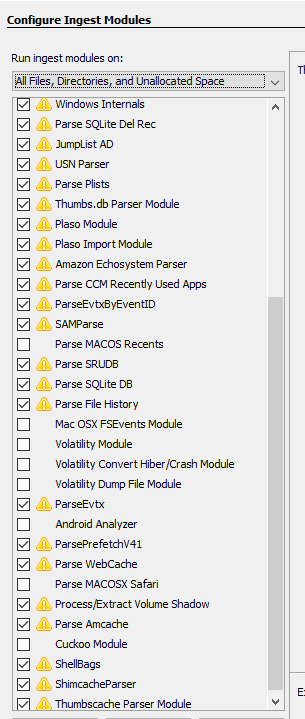
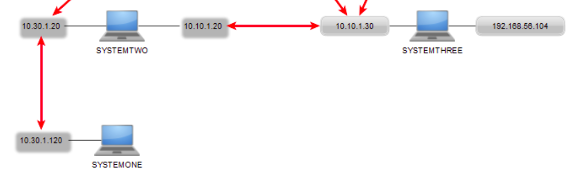
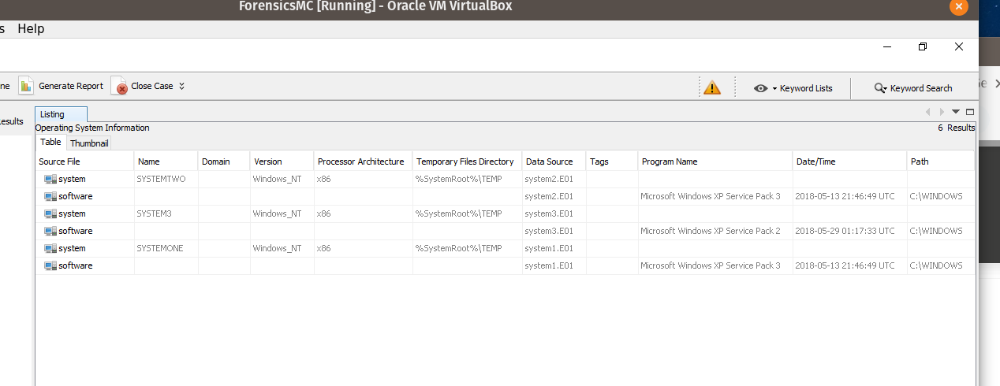
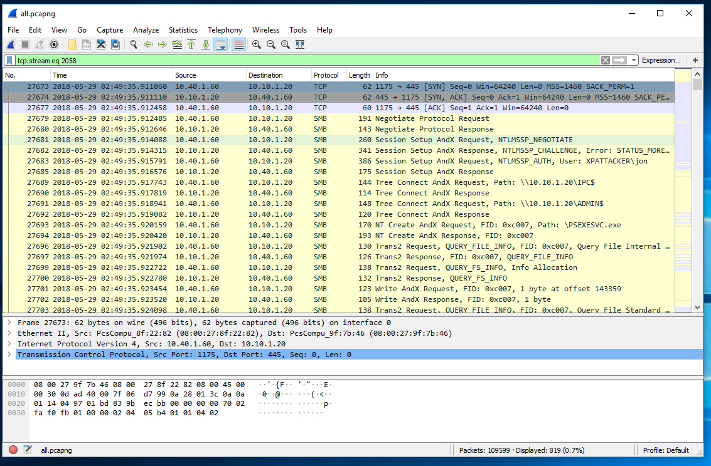
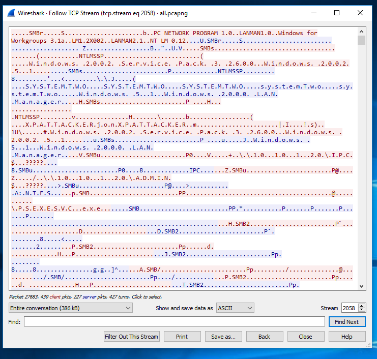
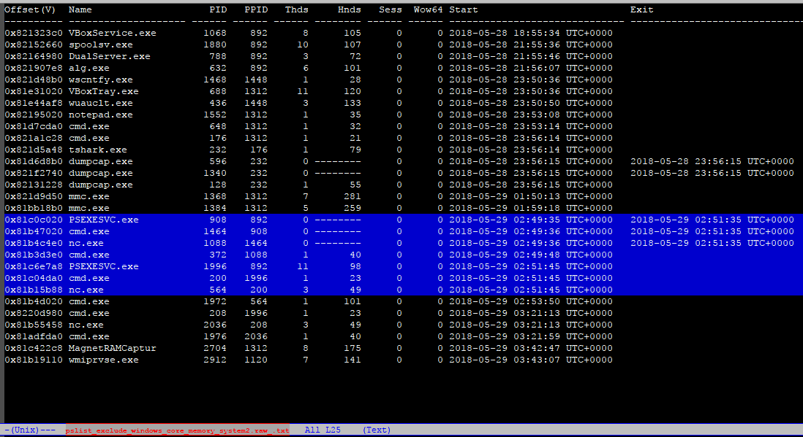
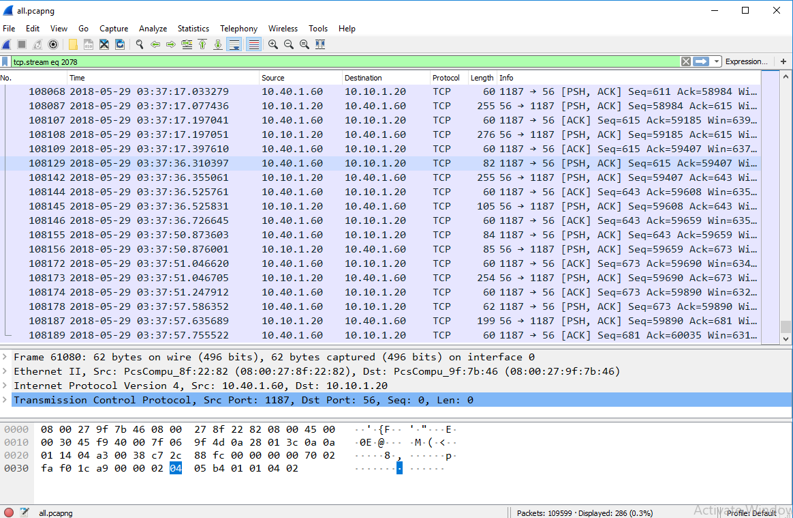
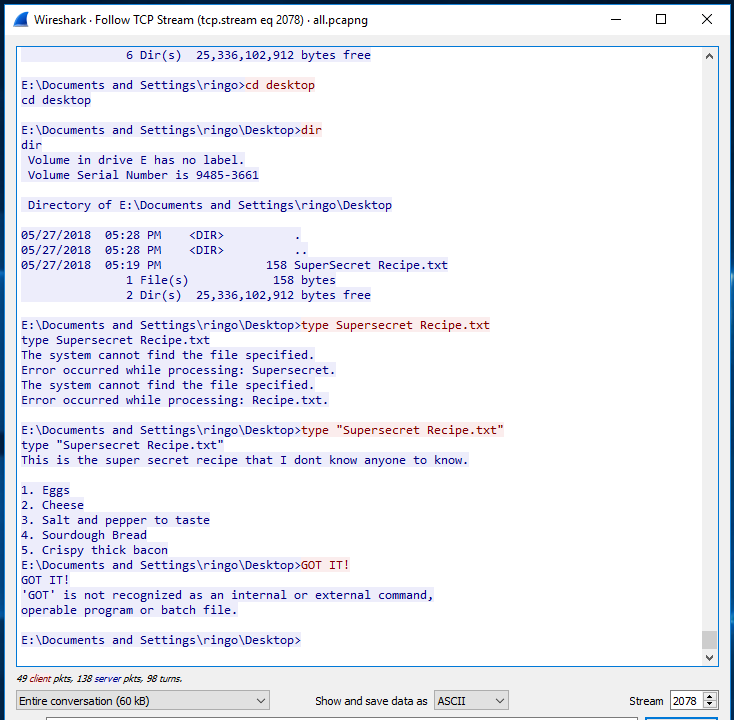
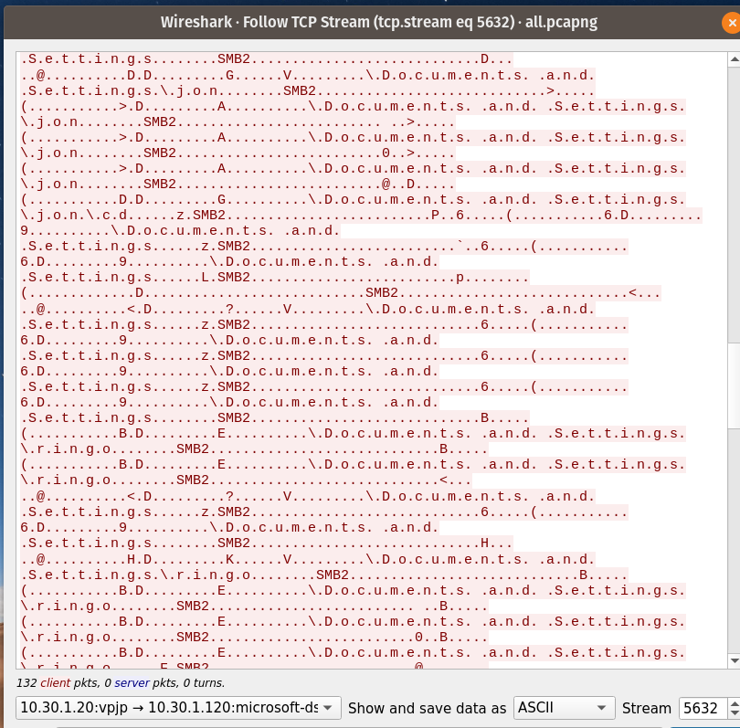

# Forensic Report: case of recipe theft

## Case Description
Case Number: recipetheft001

A company's network and systems have been compromised. The owner is concerned whether the company's proprietary super secret recipe has been stolen.

## Investigators
 The following investigation was conducted by Jennifer Hikichi and Alf Maglalang. We were given the task to find evidence of an intrusion into the company's network and discover whether secret recipe was exposed or exfiltrated. The evidence we are reviewing has been collected by previous investigators and verified to be unaltered.

## Custody tracking
Generally, a chain of custody form would be used. The evidence collectors have the original images and pcap files. We have copies -- with MD5 hashes for integrity verification.
1. client
1. evidence collectors
1. investigators: listed above

## Images and Network Traffic files
We acquired 3 disk images and 3 volatile memory images. We were also provided network traffic files (pcap) by the client.

List of provided files:
```
├───images
│       system1.E01
│       system1.E01.txt
│       system2.E01
│       system2.E01.txt
│       system3.E01
│       system3.E01.txt
│       
├───memory
│       memorySystemOne.raw
│       memory_system2.raw
│       memory_system3.raw
│       
└───pcap
        system3.pcap
        system3_1.pcap
        systemOne.pcap
        systemtwo.pcap
        systemtwo1.pcap
```
The system3_1.pcap is corrupt. And systemtwo1.pcap is a duplicate of systemtwo.pcap -- they have the same MD5 hash. We ignored those 2 files.

The systems have names SYSTEMONE, SYSTEMTWO, and SYSTEM3. The numbering in the images and pcap files corresponds to the numbering on systems' names.

## Tools

### Equipment:
- Windows 10 running as a virtual machine through Virtualbox
### Forensic Software:
- Autopsy 4.6.0
- AccessData FTK Imager 3.4.3.3
- Redline 1.20.2 from Mandiant
- Volatility 2.6
- Wireshark 3.0.4
- NetworkMiner 2.3.1
- Python 3.7.4
- Regview

## Pre-analysis
To obtain information on the systems, we used the forensic tools listed above. For the disk images, we used Autopsy with the following modules.



For the memory images, we used Redline and Volatility; for the network traffic files (pcap), Wireshark and NetworkMiner.

Results of the processing are in the following folders:
- [autopsy analysis](autopsy_analysis)
- [redline analysis](redline_analysis)
- [volatility analysis](volatility_analysis)
- [network traffic analysis](pcap_analysis)

**Please note that all time zones in the analyses were adjusted to be UTC+0.**

```
```

## Network topology
Based on information we gathered from Network Miner, we propose the following working network map.


### Systems' IP addresses
- SYSTEMONE: 10.30.1.120
- SYSTEMTWO: 10.30.1.20 and 10.10.1.20
- SYSTEM3: 10.10.1.30
### Systems' Operating Systems


## Course of investigation
We have established that the "Secret recipe.txt" file is in SYSTEMONE (10.30.1.120) which can only be accessed by SYSTEMTWO (10.30.1.20) through one of its interfaces.

All the systems are running MS Windows XP. All are running with Service Pack 3 except SYSTEM3 which is on Service Pack 2.

Based on our network traffic analysis, there are attackers coming from 2 IP addresses: 10.40.1.65 (LongName) and 10.40.1.60 (XPATTACKER). LongName (10.40.1.65) acquired credentials from SYSTEM3.
```
```
### 10.40.1.60 --> 10.10.1.20 (SYSTEMTWO)

XPATTACKER initiated an intrusion on SYSTEMTWO using credentials gathered from SYSTEM3 which allowed XPATTACKER to have system level access remotely using the `psexec` exploit on port 445. There were several intrusion attempts into SYSTEMTWO. Below is a succcessful one on frame 27673 (`tcp.stream eq 2058`).




The list of processes from volatility analysis shows the SYSTEMTWO's processes in blue that correspond to the frames above.


**Note:** Before the intrusion depicted above, there was an initial intrusion in SYSTEM3 from the attackers which allowed them to acquire a set of credentials. For example, [`tcp.stream eq 1885`](tcpstream1885.txt) (__click to see stream__) shows an attempt to gain access to SYSTEMTWO from SYSTEM3 using command `net use`.

See also:
- `tcp.stream eq 1866` (10.40.1.65 --> 10.10.1.30)
- [`tcp.stream eq 1870`](tcpstream1870.txt) (10.40.1.60 --> 10.10.1.30)

The packets associated with streams 1870 and 1885 were preceded by packets using DCERPC or SMB protocols. Top well-known Windows XP exploits used with Metasploit are ms08_067_netapi or ms06_040_netapi. We conclude that SYSTEM3 was compromised using Metasploit exploiting these vulnerabilities: [ms08_067](https://www.offensive-security.com/metasploit-unleashed/exploits/) or [ms06_040](https://highon.coffee/blog/penetration-testing-tools-cheat-sheet/) since LongName and XPATTACKER have the run of SYSTEMTWO and SYSTEM3.

### 10.30.1.20 (SYSTEMTWO) --> 10.30.1.120 (SYSTEMONE) - initiated from XPATTACKER 10.40.1.60
From SYSTEMTWO, XPATTACKER was able to gain access to SYSTEMONE, through SYSTEMTWO's interface with IP 10.30.1.20 interface and then ultimately proceeded to SYSTEMONE where the proprietary secret recipe resides. Evidence below indicates this. From 03:31:59 (frame 61080) to 03:37:57 (frame 108129), XPATTACKER maintained a session with SYSTEMTWO.




**See [full stream 2078](fullstream2078.txt)**

The 2078 stream sample above also shows that the **"Supersecret Recipe.txt"** was exposed. It was found in user **ringo** Desktop. The sample stream below shows the actual connection between SYSTEMTWO and SYSTEMONE

#### The SMB connection between SYSTEMTWO and SYSTEMONE


```
```

## Remediation and prevention recommendations
### Remediation
1. Update Windows XP platform to latest service pack and latest patch.
2. Change individual users passwords.

### Prevention
1. Make sure to be current on updates.
1. Use password generators to make passwords harder to crack.
1. Encrypt all files that are meant to be secret or has PII.
1. Restrict IPC communication.
1. Implement a password quality control program. Making the user include numbers, upper and lower case letters, special characters, and minimum length requirements.
1. Educate your employees one the importance of good password practices and not down loading non-essential programs.
1. Use a proxy to access the internet.
1. Install firewall.
1. [Patch systems regularly.](https://support.microsoft.com/en-us/help/958644/ms08-067-vulnerability-in-server-service-could-allow-remote-code-execu)
1. Install intrusion and prevention detection systems.

## Miscellaneous
As mentioned above, credentials were acquired by attackers through Metasploit. The password for user ringo in SYSTEMONE `ringo` was used to mount the share and gain access to all users' files.

Note from Rapid7 regarding Metasploit's module for exploiting unpatched Windows XP.

> MS08-067 is probably one of the easiest ways into a network if not the easiest way. Simply starting Metasploit loading the module and giving it an IP address of a vulnerable Windows host will get you full administrative access to that system.
> https://blog.rapid7.com/2014/02/03/new-ms08-067/
